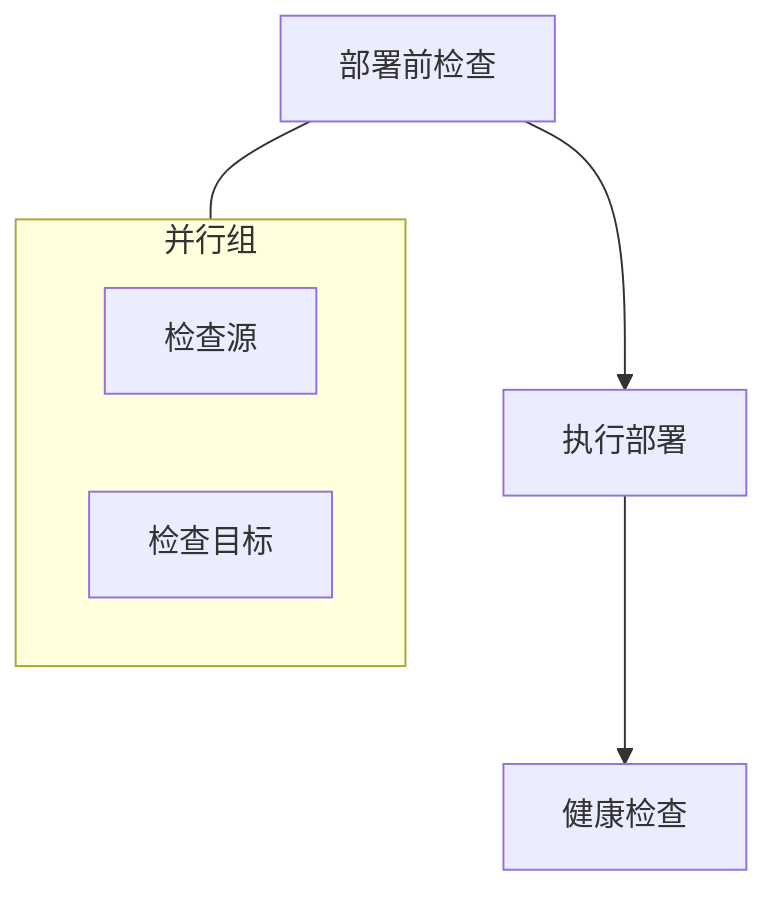

中文 | [English](./flow-run-design.md)

# flow-run — 声明式工作流引擎详细设计方案

## 1. 项目概述

### 1.1 定位

`flow-run` 是专为 AI Agent 设计的声明式工作流引擎。它解决了 Agent 执行多步骤任务时的核心痛点：
- 缺乏编排能力，步骤间依赖管理困难
- 失败后需从头重试，浪费已完成的工作
- 无法并行执行无依赖的步骤
- 缺乏条件分支和循环支持
- 输出格式不一致，Agent 解析困难

### 1.2 设计原则

| 原则 | 说明 |
|:---|:---|
| 声明式优先 | 用 YAML 定义工作流，而非编写代码 |
| JSON 原生 | 所有输出默认 JSON，无需 --json 标志 |
| DAG 编排 | 自动解析依赖，无依赖步骤并行执行 |
| 检查点 | 失败后从断点恢复，不浪费已完成的工作 |
| 条件分支 | 支持 if/else 逻辑，适应不同场景 |
| 循环 | 支持遍历数组、条件循环、范围循环 |
| Agent 友好 | 非交互式、结构化错误码、上下文窗口友好 |

---

## 2. 系统架构

```
┌─────────────────────────────────────────────────────────────────────────────┐
│                            flow-run CLI                                     │
│                                                                             │
│  ┌─────────────┐    ┌─────────────┐    ┌─────────────┐    ┌─────────────┐  │
│  │   Parser    │───▶│  Validator  │───▶│  Scheduler  │───▶│  Executor   │  │
│  │  (YAML解析) │    │  (DAG验证)  │    │  (任务调度) │    │  (任务执行) │  │
│  └─────────────┘    └─────────────┘    └──────┬──────┘    └──────┬──────┘  │
│                                                │                  │         │
│                          ┌─────────────────────┼──────────────────┘         │
│                          │                     │                            │
│                          ▼                     ▼                            │
│                   ┌─────────────┐       ┌─────────────┐                     │
│                   │  DAG Engine │       │  Checkpoint  │                    │
│                   │  (依赖解析) │       │  (断点续跑)  │                    │
│                   └─────────────┘       └─────────────┘                     │
│                                                                             │
│  ┌─────────────────────────────────────────────────────────────────────┐   │
│  │                        Step Executors                                │   │
│  │  ┌─────────┐  ┌─────────┐  ┌─────────┐  ┌─────────┐  ┌─────────┐  │   │
│  │  │   HTTP  │  │  Shell  │  │  Loop   │  │  Branch │  │Workflow │  │   │
│  │  │ Executor│  │ Executor│  │ Executor│  │ Executor│  │ Executor│  │   │
│  │  └─────────┘  └─────────┘  └─────────┘  └─────────┘  └─────────┘  │   │
│  └─────────────────────────────────────────────────────────────────────┘   │
│                                                                             │
│  ┌─────────────────────────────────────────────────────────────────────┐   │
│  │                        Support Components                            │   │
│  │  ┌─────────┐  ┌─────────┐  ┌─────────┐  ┌─────────┐  ┌─────────┐  │   │
│  │  │  Retry  │  │  Cache  │  │  Logger │  │ Metrics │  │ Secrets │  │   │
│  │  │  Engine │  │  Layer  │  │         │  │         │  │ Manager │  │   │
│  │  └─────────┘  └─────────┘  └─────────┘  └─────────┘  └─────────┘  │   │
│  └─────────────────────────────────────────────────────────────────────┘   │
└─────────────────────────────────────────────────────────────────────────────┘
```

---

## 3. YAML 工作流定义语言

### 3.1 完整示例

```yaml
# workflow.yaml
name: deploy-application
description: 自动化部署工作流
version: "1.0"

# 全局配置
config:
  timeout: 300s
  retry:
    max_attempts: 3
    strategy: exponential
  on_failure: pause
  checkpoint: /tmp/deploy.state
  max_concurrent: 5

# 输入参数
inputs:
  - name: app_name
    type: string
    required: true
  - name: environment
    type: string
    default: staging
    enum: [staging, production]
  - name: version
    type: string
    required: true
    regex: "^v[0-9]+\\.[0-9]+\\.[0-9]+$"

# 输出定义
outputs:
  deployment_id: ${{steps.deploy.response.body.id}}
  status: ${{steps.health_check.response.body.status}}

# 步骤定义
steps:
  - id: preflight
    name: 部署前检查
    type: parallel
    steps:
      - id: check_source
        type: http
        api: https://ci.example.com/builds/${{inputs.version}}
        method: GET
      - id: check_target
        type: http
        api: https://deploy.example.com/environments/${{inputs.environment}}
        method: GET

  - id: deploy
    name: 执行部署
    type: http
    api: https://deploy.example.com/deployments
    method: POST
    body:
      app: ${{inputs.app_name}}
      version: ${{inputs.version}}
    depends_on: [preflight]

  - id: health_check
    name: 健康检查
    type: http
    api: ${{steps.deploy.response.body.url}}/health
    method: GET
    depends_on: [deploy]
```

### 3.2 步骤类型

| 类型 | 说明 | 示例 |
|:---|:---|:---|
| `http` | HTTP 请求 | API 调用 |
| `shell` | Shell 命令 | 脚本执行 |
| `parallel` | 并行执行 | 无依赖步骤 |
| `condition` | 条件分支 | if/else |
| `loop` | 循环 | 遍历数组 |
| `workflow` | 子工作流 | 模块化 |
| `approve` | 人工审批 | 安全断点 |

### 3.3 模板表达式与过滤器

模板表达式使用 `${{...}}` 语法，支持管道过滤器链进行数据转换。

#### 3.3.1 基础语法

```yaml
# 简单取值
url: ${{steps.deploy.response.body.url}}
# 输出: https://myapp.example.com

# 嵌套访问
item: ${{steps.fetch.outputs.data.items[0].name}}
# 输出: first-item
```

#### 3.3.2 过滤器链

使用 `|` 管道符串联过滤器，支持数据转换：

```yaml
body:
  # 大小写转换
  message: ${{ steps.check.outputs.result | uppercase }}
  # 输出: SUCCESS
  
  # 数值格式化
  duration: ${{ steps.deploy.outputs.duration_ms | format_duration }}
  # 输出: 2m 34s
  
  # 默认值
  fallback_name: ${{ steps.optional.value | default("unknown") }}
  # 当 steps.optional.value 不存在时输出: unknown
  
  # 数组过滤
  active_users: ${{ steps.fetch_users.outputs.list | filter_by(status=active) }}
  
  # 数组切片
  top_items: ${{ steps.fetch_list.outputs.data | slice(0,10) }}
  
  # JSON 序列化
  payload: ${{ steps.prepare.outputs | to_json }}
  
  # 字符串截断
  preview: ${{ steps.get_content.outputs.body | truncate(100) }}
  
  # 正则提取
  version: ${{ steps.get_tag.outputs.ref | regex_extract("^v(.+)$") }}
  # 输出: 1.2.3 (去掉 v 前缀)
```

#### 3.3.3 条件表达式

```yaml
# 三元表达式
env: ${{ inputs.environment || "staging" }}

# 布尔判断
should_deploy: ${{ steps.check.outputs.status == "ready" }}

# 数组判断
has_items: ${{ length(steps.fetch.outputs.list) > 0 }}
```

#### 3.3.4 内置过滤器

| 过滤器 | 说明 | 示例 |
|:---|:---|:---|
| `uppercase` | 转大写 | `HELLO` |
| `lowercase` | 转小写 | `hello` |
| `capitalize` | 首字母大写 | `Hello` |
| `trim` | 去除首尾空格 | `hello` |
| `default(value)` | 默认值 | fallback |
| `to_json` | 序列化为 JSON | `{"key":"val"}` |
| `from_json` | JSON 反序列化 | `{key: "val"}` |
| `length` | 数组/字符串长度 | `5` |
| `slice(start, end)` | 数组切片 | `[0,1,2]` |
| `filter_by(field=val)` | 数组过滤 | `[{...},...]` |
| `first` | 取第一个元素 | `item` |
| `last` | 取最后一个元素 | `item` |
| `join(sep)` | 数组拼接字符串 | `"a,b,c"` |
| `split(sep)` | 字符串分割数组 | `["a","b"]` |
| `replace(old, new)` | 字符串替换 | `"hello"` |
| `regex_extract(pattern)` | 正则提取 | `"match"` |
| `format_timestamp` | 格式化时间戳 | `"2026-03-23 10:00"` |
| `format_duration` | 格式化毫秒 | `"2m 34s"` |
| `truncate(n)` | 截断字符串 | `"hel..."` |
| `base64_encode` | Base64 编码 | `"aGVsbG8="` |
| `base64_decode` | Base64 解码 | `"hello"` |

#### 3.3.5 类型安全

模板引擎会验证表达式的类型正确性：

```yaml
# 类型错误会在 validate 阶段检测
body:
  count: ${{ steps.fetch.outputs.data | length }}  # OK: 返回 integer
  name: ${{ steps.fetch.outputs.data | length }}   # Error: 类型不匹配警告
```

---

## 4. DAG 调度引擎

### 4.1 依赖解析算法

```rust
use std::collections::{HashMap, VecDeque};

struct DagScheduler {
    steps: Vec<Step>,
    adjacency: HashMap<StepId, Vec<StepId>>,
    in_degree: HashMap<StepId, usize>,
}

impl DagScheduler {
    fn new(steps: Vec<Step>) -> Result<Self, CycleError> {
        let mut adjacency: HashMap<StepId, Vec<StepId>> = HashMap::new();
        let mut in_degree: HashMap<StepId, usize> = HashMap::new();
        
        // 初始化入度
        for step in &steps {
            in_degree.entry(step.id).or_insert(0);
        }
        
        // 构建邻接表和入度表
        for step in &steps {
            for dep in &step.depends_on {
                adjacency.entry(*dep).or_default().push(step.id);
                *in_degree.entry(step.id).or_insert(0) += 1;
            }
        }
        
        // 检测循环依赖
        if Self::has_cycle(&adjacency, &steps) {
            return Err(CycleError::Detected);
        }
        
        Ok(Self { steps, adjacency, in_degree })
    }
    
    /// 拓扑排序，返回执行批次
    fn topological_sort(&self) -> Result<Vec<Vec<StepId>>, CycleError> {
        let mut in_degree = self.in_degree.clone();
        let mut queue: VecDeque<StepId> = in_degree
            .iter()
            .filter(|(_, &deg)| deg == 0)
            .map(|(&id, _)| id)
            .collect();
        
        let mut batches = vec![];
        
        while !queue.is_empty() {
            let batch: Vec<StepId> = queue.drain(..).collect();
            
            for &step_id in &batch {
                for &neighbor in self.adjacency.get(&step_id).unwrap_or(&vec![]) {
                    let deg = in_degree.get_mut(&neighbor).unwrap();
                    *deg -= 1;
                    if *deg == 0 {
                        queue.push_back(neighbor);
                    }
                }
            }
            
            batches.push(batch);
        }
        
        // 验证所有步骤都被处理
        let total_steps: usize = batches.iter().map(|b| b.len()).sum();
        if total_steps != self.steps.len() {
            return Err(CycleError::Detected);
        }
        
        Ok(batches)
    }
    
    fn has_cycle(adjacency: &HashMap<StepId, Vec<StepId>>, steps: &[Step]) -> bool {
        let mut visited = HashSet::new();
        let mut rec_stack = HashSet::new();
        
        for step in steps {
            if Self::dfs_cycle_check(step.id, adjacency, &mut visited, &mut rec_stack) {
                return true;
            }
        }
        
        false
    }
    
    fn dfs_cycle_check(
        node: StepId,
        adjacency: &HashMap<StepId, Vec<StepId>>,
        visited: &mut HashSet<StepId>,
        rec_stack: &mut HashSet<StepId>,
    ) -> bool {
        visited.insert(node);
        rec_stack.insert(node);
        
        for &neighbor in adjacency.get(&node).unwrap_or(&vec![]) {
            if !visited.contains(&neighbor) {
                if Self::dfs_cycle_check(neighbor, adjacency, visited, rec_stack) {
                    return true;
                }
            } else if rec_stack.contains(&neighbor) {
                return true;
            }
        }
        
        rec_stack.remove(&node);
        false
    }
}
```

### 4.2 执行调度器

```rust
struct Scheduler {
    dag: DagScheduler,
    executor: Arc<Executor>,
    context: Arc<RwLock<ExecutionContext>>,
    checkpoint: CheckpointManager,
    config: WorkflowConfig,
}

impl Scheduler {
    async fn run(&mut self) -> Result<WorkflowResult, WorkflowError> {
        let batches = self.dag.topological_sort()?;
        
        for (batch_idx, batch) in batches.iter().enumerate() {
            // 执行当前批次（并行）
            let results = self.execute_batch(batch).await?;
            
            // 更新上下文
            let mut context = self.context.write().await;
            for result in &results {
                context.step_outputs.insert(result.step_id, result.clone());
                
                match result.status {
                    StepStatus::Success => {
                        context.completed_steps.insert(result.step_id);
                    }
                    StepStatus::Failed => {
                        match self.config.on_failure {
                            OnFailure::Abort => {
                                return Err(WorkflowError::StepFailed(result.step_id));
                            }
                            OnFailure::Pause => {
                                self.checkpoint.save(&context).await?;
                                return Ok(WorkflowResult::Paused {
                                    checkpoint_id: self.checkpoint.id.clone(),
                                    failed_step: result.step_id,
                                });
                            }
                            OnFailure::Continue => {
                                context.failed_steps.insert(result.step_id);
                            }
                        }
                    }
                    _ => {}
                }
            }
            
            // 保存检查点
            self.checkpoint.save(&context).await?;
        }
        
        Ok(WorkflowResult::Success {
            outputs: self.collect_outputs().await?,
        })
    }
    
    async fn execute_batch(&self, batch: &[StepId]) -> Result<Vec<StepResult>, WorkflowError> {
        let mut handles = vec![];
        
        for &step_id in batch {
            let step = self.dag.steps.iter().find(|s| s.id == step_id).unwrap();
            let executor = self.executor.clone();
            let context = self.context.clone();
            
            handles.push(tokio::spawn(async move {
                executor.execute(step, &context.read().await).await
            }));
        }
        
        let mut results = vec![];
        for handle in handles {
            results.push(handle.await??);
        }
        
        Ok(results)
    }
}
```

### 4.3 步骤级并发控制与速率限制

全局 `max_concurrent` 无法满足不同步骤的资源消耗差异。需要步骤级精细控制。

#### 4.3.1 YAML 定义

```yaml
steps:
  - id: api_calls
    type: parallel
    max_concurrent: 10      # 步骤级并发控制（覆盖全局配置）
    rate_limit:              # 速率限制
      requests_per_second: 5
      burst: 10
    steps:
      - id: call_1
        type: http
        api: https://api.example.com/item/1
      - id: call_2
        type: http
        api: https://api.example.com/item/2
      # ... 更多并行请求

  - id: heavy_deployment
    type: shell
    max_concurrent: 1        # 重量级操作限制并发
    timeout: 300s
    run: ./deploy.sh

  - id: bulk_notifications
    type: parallel
    max_concurrent: 20       # 轻量级操作高并发
    rate_limit:
      requests_per_second: 100
    steps: [...]
```

#### 4.3.2 速率限制实现

```rust
#[derive(Clone, Serialize, Deserialize)]
struct RateLimitConfig {
    requests_per_second: f64,
    burst: u32,
}

struct RateLimiter {
    inner: governor::RateLimiter<
        governor::state::InMemoryState,
        governor::clock::DefaultClock,
        governor::middleware::NoOpMiddleware,
    >,
}

impl RateLimiter {
    fn new(config: &RateLimitConfig) -> Self {
        use governor::{Quota, RateLimiter};
        use std::num::NonZeroU32;
        
        let quota = Quota::per_second(NonZeroU32::new(config.requests_per_second as u32).unwrap())
            .burst_size(NonZeroU32::new(config.burst).unwrap());
        
        Self {
            inner: RateLimiter::direct(quota),
        }
    }
    
    async fn wait(&self) -> Result<(), RateLimitError> {
        self.inner.until_ready().await?;
        Ok(())
    }
}

struct ConcurrencyLimiter {
    semaphore: Arc<Semaphore>,
    rate_limiter: Option<Arc<RateLimiter>>,
}

impl ConcurrencyLimiter {
    fn new(max_concurrent: usize, rate_limit: Option<RateLimitConfig>) -> Self {
        Self {
            semaphore: Arc::new(Semaphore::new(max_concurrent)),
            rate_limiter: rate_limit.map(|config| Arc::new(RateLimiter::new(&config))),
        }
    }
    
    async fn acquire(&self) -> Result<ConcurrencyPermit, WorkflowError> {
        let permit = self.semaphore.acquire().await?;
        
        if let Some(ref limiter) = self.rate_limiter {
            limiter.wait().await?;
        }
        
        Ok(ConcurrencyPermit { _permit: permit })
    }
}
```

#### 4.3.3 调度器集成

```rust
impl Scheduler {
    async fn execute_batch_with_limits(
        &self,
        batch: &[StepId],
        concurrency_limits: &HashMap<StepId, ConcurrencyLimiter>,
    ) -> Result<Vec<StepResult>, WorkflowError> {
        let mut handles = vec![];
        
        for &step_id in batch {
            let step = self.dag.steps.iter().find(|s| s.id == step_id).unwrap();
            
            // 获取该步骤的并发限制器
            let limiter = concurrency_limits.get(&step_id);
            
            let executor = self.executor.clone();
            let context = self.context.clone();
            let limiter = limiter.cloned();
            
            handles.push(tokio::spawn(async move {
                // 获取许可（限制并发和速率）
                let _permit = if let Some(limiter) = limiter {
                    Some(limiter.acquire().await?)
                } else {
                    None
                };
                
                executor.execute(step, &context.read().await).await
            }));
        }
        
        let mut results = vec![];
        for handle in handles {
            results.push(handle.await??);
        }
        
        Ok(results)
    }
}
```

#### 4.3.4 全局与步骤级配置合并

```rust
struct WorkflowConfig {
    // 全局配置（默认值）
    max_concurrent: usize,          // 全局并发限制
    rate_limit: Option<RateLimitConfig>,  // 全局速率限制
}

struct StepConfig {
    // 步骤级配置（覆盖全局）
    max_concurrent: Option<usize>,
    rate_limit: Option<RateLimitConfig>,
}

impl StepConfig {
    fn effective_concurrency(&self, global: &WorkflowConfig) -> usize {
        self.max_concurrent.unwrap_or(global.max_concurrent)
    }
    
    fn effective_rate_limit(&self, global: &WorkflowConfig) -> Option<RateLimitConfig> {
        self.rate_limit.clone().or(global.rate_limit.clone())
    }
}
```


---

## 5. 步骤执行器

### 5.1 HTTP 执行器

```rust
struct HttpExecutor {
    client: reqwest::Client,
    retry_engine: RetryEngine,
    cache_layer: CacheLayer,
}

impl HttpExecutor {
    async fn execute(&self, step: &HttpStep, context: &ExecutionContext) -> StepResult {
        // 1. 解析模板表达式
        let url = self.resolve_template(&step.api, context)?;
        let headers = self.resolve_headers(&step.headers, context)?;
        let body = self.resolve_body(&step.body, context)?;
        
        // 2. 检查缓存
        let cache_key = self.generate_cache_key(&url, &step.method, &body);
        if let Some(cached) = self.cache_layer.get(&cache_key).await {
            return StepResult::from_cache(cached);
        }
        
        // 3. 构建请求
        let mut request = self.client.request(step.method.parse()?, &url);
        for (key, value) in headers {
            request = request.header(key, value);
        }
        if let Some(body) = body {
            request = request.json(&body);
        }
        
        // 4. 执行请求（带重试）
        let response = self.retry_engine.execute(|| {
            request.try_clone().unwrap().send()
        }).await?;
        
        // 5. 解析响应
        let status_code = response.status().as_u16();
        let response_headers = response.headers().clone();
        let response_body: serde_json::Value = response.json().await?;
        
        // 6. 验证期望结果
        if let Some(expect) = &step.expect {
            self.validate_expect(expect, status_code, &response_body)?;
        }
        
        // 7. 缓存响应
        if let Some(cache_config) = &step.cache {
            self.cache_layer.set(&cache_key, &response_body, cache_config.ttl).await?;
        }
        
        StepResult::success(HttpResponse {
            status_code,
            headers: response_headers,
            body: response_body,
        })
    }
    
    fn resolve_template(&self, template: &str, context: &ExecutionContext) -> Result<String, TemplateError> {
        let mut result = template.to_string();
        
        // 解析 ${{...}} 表达式
        let re = Regex::new(r"\$\{\{([^}]+)\}\}")?;
        for cap in re.captures_iter(template) {
            let expr = &cap[1];
            let value = context.evaluate(expr)?;
            result = result.replace(&cap[0], &value.to_string());
        }
        
        Ok(result)
    }
}
```

### 5.2 Shell 执行器

```rust
struct ShellExecutor {
    timeout: Duration,
    env_vars: HashMap<String, String>,
}

impl ShellExecutor {
    async fn execute(&self, step: &ShellStep, context: &ExecutionContext) -> StepResult {
        // 1. 解析命令中的模板
        let command = self.resolve_template(&step.run, context)?;
        
        // 2. 准备环境变量
        let mut envs = self.env_vars.clone();
        for (key, value) in &step.env {
            envs.insert(key.clone(), self.resolve_template(value, context)?);
        }
        
        // 3. 执行命令
        let output = tokio::process::Command::new("bash")
            .arg("-c")
            .arg(&command)
            .envs(&envs)
            .stdout(Stdio::piped())
            .stderr(Stdio::piped())
            .output()
            .timeout(self.timeout)
            .await??;
        
        let stdout = String::from_utf8_lossy(&output.stdout).to_string();
        let stderr = String::from_utf8_lossy(&output.stderr).to_string();
        let exit_code = output.status.code().unwrap_or(-1);
        
        // 4. 验证期望结果
        if let Some(expect) = &step.expect {
            self.validate_expect(expect, exit_code, &stdout)?;
        }
        
        StepResult::success(ShellResponse {
            exit_code,
            stdout,
            stderr,
        })
    }
}
```

#### 5.2.1 Shell 安全模式

防止危险命令执行，保护生产环境。

```yaml
steps:
  - id: cleanup
    type: shell
    safe_mode: strict        # 启用安全模式
    allowed_commands:        # 白名单模式
      - "ls"
      - "cat"
      - "echo"
      - "grep"
    run: ./scripts/cleanup.sh

  - id: risky_cleanup
    type: shell
    safe_mode: warn          # 仅警告，不阻止
    run: rm -rf /tmp/cache/*
    
  - id: full_trust
    type: shell
    safe_mode: none          # 禁用安全模式
    run: sudo systemctl restart nginx
```

**安全模式级别：**

| 级别 | 说明 | 行为 |
|:---|:---|:---|
| `strict` | 严格模式 | 禁止危险命令，执行前检查 |
| `warn` | 警告模式 | 允许执行，输出警告日志 |
| `none` | 无限制 | 不进行安全检查 |

**默认禁止的危险模式（strict 模式）：**

```rust
struct ShellSafetyChecker {
    // 危险模式黑名单
    blocked_patterns: Vec<Regex>,
    // 环境保护
    protected_paths: Vec<PathBuf>,
}

impl ShellSafetyChecker {
    fn default() -> Self {
        Self {
            blocked_patterns: vec![
                Regex::new(r"rm\s+-rf\s+[/~]").unwrap(),        // rm -rf / 或 rm -rf ~
                Regex::new(r"rm\s+-rf\s+\*").unwrap(),          // rm -rf *
                Regex::new(r":\(\)\{.*:\|.*&\s*;\s*:\}").unwrap(), // fork bomb
                Regex::new(r"dd\s+if=/dev/").unwrap(),           // dd 到设备
                Regex::new(r"mkfs\.").unwrap(),                  // 格式化磁盘
                Regex::new(r"chmod\s+777").unwrap(),             // 过度授权
                Regex::new(r">\s+/dev/sd").unwrap(),             // 写入磁盘设备
                Regex::new(r"curl.*\|\s*(ba)?sh").unwrap(),      // 管道到 shell
            ],
            protected_paths: vec![
                PathBuf::from("/"),
                PathBuf::from("/etc"),
                PathBuf::from("/usr"),
                PathBuf::from("/bin"),
                PathBuf::from("/sbin"),
            ],
        }
    }
    
    fn check_command(&self, command: &str) -> Result<(), SafetyViolation> {
        // 检查危险模式
        for pattern in &self.blocked_patterns {
            if pattern.is_match(command) {
                return Err(SafetyViolation::BlockedPattern {
                    pattern: pattern.as_str().to_string(),
                    command: command.to_string(),
                });
            }
        }
        
        // 检查工作目录是否在受保护路径
        // ...
        
        Ok(())
    }
}
```

### 5.3 循环执行器

```rust
struct LoopExecutor {
    inner_executor: Arc<Executor>,
}

impl LoopExecutor {
    async fn execute(&self, step: &LoopStep, context: &ExecutionContext) -> StepResult {
        let mut results = vec![];
        
        match &step.loop_type {
            LoopType::ForEach { over, as_name } => {
                // 遍历数组
                let items: Vec<serde_json::Value> = context.evaluate(over)?;
                
                for (idx, item) in items.iter().enumerate() {
                    let mut loop_context = context.clone();
                    loop_context.set_variable(as_name, item.clone());
                    loop_context.set_variable("index", idx.into());
                    
                    for inner_step in &step.do_steps {
                        let result = self.inner_executor.execute(inner_step, &loop_context).await?;
                        results.push(result);
                    }
                }
            }
            
            LoopType::While { condition, max_iterations } => {
                // 条件循环
                let mut iteration = 0;
                
                while context.evaluate(condition)? && iteration < *max_iterations {
                    for inner_step in &step.do_steps {
                        let result = self.inner_executor.execute(inner_step, context).await?;
                        results.push(result);
                    }
                    iteration += 1;
                }
            }
            
            LoopType::Range { start, end } => {
                // 范围循环
                for idx in *start..*end {
                    let mut loop_context = context.clone();
                    loop_context.set_variable("index", idx.into());
                    
                    for inner_step in &step.do_steps {
                        let result = self.inner_executor.execute(inner_step, &loop_context).await?;
                        results.push(result);
                    }
                }
            }
        }
        
        StepResult::success(LoopResponse { iterations: results.len(), results })
    }
}
```

### 5.4 条件执行器

```rust
struct ConditionExecutor {
    then_executor: Arc<Executor>,
    else_executor: Arc<Executor>,
}

impl ConditionExecutor {
    async fn execute(&self, step: &ConditionStep, context: &ExecutionContext) -> StepResult {
        let condition_result: bool = context.evaluate(&step.expression)?;
        
        if condition_result {
            // 执行 then 分支
            let mut results = vec![];
            for inner_step in &step.then_steps {
                let result = self.then_executor.execute(inner_step, context).await?;
                results.push(result);
            }
            StepResult::success(BranchResponse { branch: "then", results })
        } else {
            // 执行 else 分支
            if let Some(else_steps) = &step.else_steps {
                let mut results = vec![];
                for inner_step in else_steps {
                    let result = self.else_executor.execute(inner_step, context).await?;
                    results.push(result);
                }
                StepResult::success(BranchResponse { branch: "else", results })
            } else {
                StepResult::skipped("else branch not defined")
            }
        }
    }
}
```

### 5.5 人工审批执行器 (Human-in-the-Loop)

Agent 执行关键操作（部署生产、删除数据、发送邮件）时，需要人类审批断点。

#### 5.5.1 YAML 定义

```yaml
steps:
  - id: approve_production_deploy
    type: approve
    name: 生产环境部署审批
    message: |
      准备将 ${{inputs.version}} 部署到生产环境。
      
      部署信息：
      - 应用: ${{inputs.app_name}}
      - 版本: ${{inputs.version}}
      - 环境: production
      
      确认继续？
    approvers:
      - team-leads@company.com
      - ops@company.com
    timeout: 3600s          # 审批超时
    on_timeout: abort       # 超时策略: abort | pause | continue
    require_comment: true   # 是否要求审批意见
    auto_approve_on:        # 自动审批条件
      - condition: "${{inputs.environment == 'staging'}}"
        reason: "staging 环境自动通过"
```

#### 5.5.2 审批状态

```rust
struct ApproveExecutor {
    notification_service: Arc<NotificationService>,
    storage: Arc<ApprovalStorage>,
}

enum ApprovalStatus {
    Pending,      // 等待审批
    Approved,     // 已批准
    Rejected,     // 已拒绝
    TimedOut,     // 超时
    AutoApproved, // 自动批准
}

struct ApprovalRecord {
    step_id: StepId,
    workflow_execution_id: String,
    message: String,
    approvers: Vec<String>,
    status: ApprovalStatus,
    approved_by: Option<String>,
    approved_at: Option<DateTime<Utc>>,
    comment: Option<String>,
    timeout_at: DateTime<Utc>,
}

impl ApproveExecutor {
    async fn execute(&self, step: &ApproveStep, context: &ExecutionContext) -> StepResult {
        // 1. 检查自动审批条件
        for auto_rule in &step.auto_approve_on {
            if context.evaluate(&auto_rule.condition)? {
                return StepResult::success(ApprovalResponse {
                    status: ApprovalStatus::AutoApproved,
                    approved_by: "system".to_string(),
                    comment: Some(auto_rule.reason.clone()),
                });
            }
        }
        
        // 2. 发送审批通知
        let approval = ApprovalRecord {
            step_id: step.id.clone(),
            workflow_execution_id: context.execution_id.clone(),
            message: self.resolve_template(&step.message, context)?,
            approvers: step.approvers.clone(),
            status: ApprovalStatus::Pending,
            approved_by: None,
            approved_at: None,
            comment: None,
            timeout_at: Utc::now() + step.timeout,
        };
        
        self.storage.save(&approval).await?;
        self.notification_service.send_approval_request(&approval).await?;
        
        // 3. 等待审批或超时
        let result = self.wait_for_approval(&step.id, step.timeout).await?;
        
        StepResult::success(result)
    }
    
    async fn wait_for_approval(&self, step_id: &str, timeout: Duration) -> Result<ApprovalResponse, WorkflowError> {
        let poll_interval = Duration::from_secs(10);
        let deadline = Instant::now() + timeout;
        
        loop {
            if let Some(approval) = self.storage.get(step_id).await? {
                match approval.status {
                    ApprovalStatus::Approved => {
                        return Ok(ApprovalResponse {
                            status: ApprovalStatus::Approved,
                            approved_by: approval.approved_by.unwrap(),
                            comment: approval.comment,
                        });
                    }
                    ApprovalStatus::Rejected => {
                        return Err(WorkflowError::Rejected {
                            step_id: step_id.to_string(),
                            reason: approval.comment.unwrap_or_default(),
                        });
                    }
                    _ => {}
                }
            }
            
            if Instant::now() >= deadline {
                return Ok(ApprovalResponse {
                    status: ApprovalStatus::TimedOut,
                    approved_by: "timeout".to_string(),
                    comment: Some("审批超时".to_string()),
                });
            }
            
            tokio::time::sleep(poll_interval).await;
        }
    }
}
```

#### 5.5.3 审批查询 API

```bash
# 查看待审批项
flow-run approve list --pending

# 批准
flow-run approve approve step_id --comment "已确认"

# 拒绝
flow-run approve reject step_id --reason "风险未评估"

# 查看审批详情
flow-run approve show step_id
```

### 5.6 子工作流执行器与错误传播

#### 5.6.1 YAML 定义

```yaml
steps:
  - id: run_cleanup
    type: workflow
    name: 执行清理子工作流
    workflow: cleanup.yaml
    inputs:
      target: ${{inputs.environment}}
      dry_run: ${{inputs.dry_run}}
    error_strategy: continue  # 关键配置
    timeout: 120s
```

#### 5.6.2 错误策略

```rust
enum SubWorkflowErrorStrategy {
    Propagate,   // 向上传播，父工作流失败（默认）
    Continue,    // 子工作流失败，父工作流继续
    Retry,       // 子工作流失败，重试子工作流
    Ignore,      // 忽略错误，标记为 skipped
}

struct WorkflowExecutor {
    runner: Arc<WorkflowRunner>,
}

impl WorkflowExecutor {
    async fn execute(&self, step: &WorkflowStep, context: &ExecutionContext) -> StepResult {
        // 1. 解析子工作流路径
        let workflow_path = self.resolve_workflow_path(&step.workflow)?;
        
        // 2. 准备子工作流输入
        let mut inputs = step.inputs.clone();
        for (key, value) in inputs.iter_mut() {
            *value = self.resolve_template(value, context)?;
        }
        
        // 3. 执行子工作流
        let result = self.runner.run_with_inputs(&workflow_path, inputs).await;
        
        // 4. 根据错误策略处理结果
        match result {
            Ok(output) => StepResult::success(WorkflowResponse {
                outputs: output.outputs,
                metrics: output.metrics,
            }),
            Err(err) => match step.error_strategy {
                SubWorkflowErrorStrategy::Propagate => {
                    StepResult::failed(err)
                }
                SubWorkflowErrorStrategy::Continue => {
                    StepResult::failed_with_warning(err, "子工作流失败，继续执行")
                }
                SubWorkflowErrorStrategy::Retry => {
                    // 重试逻辑由外层 RetryEngine 处理
                    StepResult::failed(err)
                }
                SubWorkflowErrorStrategy::Ignore => {
                    StepResult::skipped(format!("子工作流失败: {}", err))
                }
            }
        }
    }
}
```

#### 5.6.3 上下文隔离

```yaml
# 子工作流默认隔离上下文
steps:
  - id: isolated_workflow
    type: workflow
    workflow: cleanup.yaml
    isolation: true  # 默认 true，不共享父工作流变量
    
  - id: shared_workflow
    type: workflow
    workflow: deploy.yaml
    isolation: false  # 共享父工作流变量
    passthrough_vars:  # 或只传递特定变量
      - deployment_id
      - environment
```


---

## 6. 检查点与断点续跑

### 6.1 检查点数据结构

```rust
#[derive(Serialize, Deserialize)]
struct Checkpoint {
    id: String,
    workflow_id: String,
    workflow_name: String,
    started_at: DateTime<Utc>,
    checkpoint_at: DateTime<Utc>,
    status: CheckpointStatus,
    
    // 执行状态
    completed_steps: HashSet<StepId>,
    failed_steps: HashSet<StepId>,
    current_batch: usize,
    
    // 步骤输出（用于恢复上下文）
    step_outputs: HashMap<StepId, StepResult>,
    
    // 全局变量
    variables: HashMap<String, serde_json::Value>,
}

enum CheckpointStatus {
    Running,
    Paused,
    Failed,
}
```

### 6.2 检查点管理器

```rust
struct CheckpointManager {
    base_dir: PathBuf,
    checkpoint: Option<Checkpoint>,
}

impl CheckpointManager {
    fn new(base_dir: PathBuf) -> Self {
        Self { base_dir, checkpoint: None }
    }
    
    async fn save(&mut self, context: &ExecutionContext) -> Result<(), CheckpointError> {
        let checkpoint = Checkpoint {
            id: self.checkpoint.as_ref()
                .map(|c| c.id.clone())
                .unwrap_or_else(|| Self::generate_id()),
            workflow_id: context.workflow_id.clone(),
            workflow_name: context.workflow_name.clone(),
            started_at: context.started_at,
            checkpoint_at: Utc::now(),
            status: CheckpointStatus::Running,
            completed_steps: context.completed_steps.clone(),
            failed_steps: context.failed_steps.clone(),
            current_batch: context.current_batch,
            step_outputs: context.step_outputs.clone(),
            variables: context.variables.clone(),
        };
        
        let path = self.base_dir.join(format!("{}.json", checkpoint.id));
        let json = serde_json::to_string_pretty(&checkpoint)?;
        tokio::fs::write(&path, json).await?;
        
        self.checkpoint = Some(checkpoint);
        Ok(())
    }
    
    async fn load(checkpoint_id: &str, base_dir: &Path) -> Result<Checkpoint, CheckpointError> {
        let path = base_dir.join(format!("{}.json", checkpoint_id));
        let json = tokio::fs::read_to_string(&path).await?;
        let checkpoint: Checkpoint = serde_json::from_str(&json)?;
        Ok(checkpoint)
    }
    
    async fn list(base_dir: &Path) -> Result<Vec<CheckpointInfo>, CheckpointError> {
        let mut checkpoints = vec![];
        
        let mut entries = tokio::fs::read_dir(base_dir).await?;
        while let Some(entry) = entries.next_entry().await? {
            if entry.path().extension().map_or(false, |ext| ext == "json") {
                if let Ok(json) = tokio::fs::read_to_string(entry.path()).await {
                    if let Ok(checkpoint) = serde_json::from_str::<Checkpoint>(&json) {
                        checkpoints.push(CheckpointInfo {
                            id: checkpoint.id,
                            workflow_name: checkpoint.workflow_name,
                            status: checkpoint.status,
                            checkpoint_at: checkpoint.checkpoint_at,
                        });
                    }
                }
            }
        }
        
        checkpoints.sort_by(|a, b| b.checkpoint_at.cmp(&a.checkpoint_at));
        Ok(checkpoints)
    }
    
    fn generate_id() -> String {
        format!("cp_{}", Uuid::new_v4().to_string().replace("-", ""))
    }
}
```

### 6.3 断点续跑流程

```rust
impl Scheduler {
    async fn resume(&mut self, checkpoint_id: &str) -> Result<WorkflowResult, WorkflowError> {
        // 1. 加载检查点
        let checkpoint = CheckpointManager::load(checkpoint_id, &self.checkpoint.base_dir).await?;
        
        // 2. 恢复执行上下文
        let mut context = self.context.write().await;
        context.completed_steps = checkpoint.completed_steps;
        context.failed_steps = checkpoint.failed_steps;
        context.step_outputs = checkpoint.step_outputs;
        context.variables = checkpoint.variables;
        context.current_batch = checkpoint.current_batch;
        
        // 3. 获取剩余批次
        let all_batches = self.dag.topological_sort()?;
        let remaining_batches = &all_batches[checkpoint.current_batch..];
        
        // 4. 继续执行
        for (idx, batch) in remaining_batches.iter().enumerate() {
            context.current_batch = checkpoint.current_batch + idx;
            
            let results = self.execute_batch(batch).await?;
            
            for result in results {
                context.step_outputs.insert(result.step_id, result.clone());
                
                match result.status {
                    StepStatus::Success => {
                        context.completed_steps.insert(result.step_id);
                    }
                    StepStatus::Failed => {
                        match self.config.on_failure {
                            OnFailure::Abort => {
                                return Err(WorkflowError::StepFailed(result.step_id));
                            }
                            OnFailure::Pause => {
                                self.checkpoint.save(&context).await?;
                                return Ok(WorkflowResult::Paused {
                                    checkpoint_id: checkpoint.id.clone(),
                                    failed_step: result.step_id,
                                });
                            }
                            OnFailure::Continue => {
                                context.failed_steps.insert(result.step_id);
                            }
                        }
                    }
                    _ => {}
                }
            }
            
            self.checkpoint.save(&context).await?;
        }
        
        Ok(WorkflowResult::Success {
            outputs: self.collect_outputs().await?,
        })
    }
}
```

### 6.4 超时链设计

当前设计的问题：一个 300s 超时的工作流，执行到第 280s 时暂停，恢复后只有 20s 剩余，但当前设计会重新开始计时。

#### 6.4.1 超时上下文保存

```rust
struct Checkpoint {
    // ... 原有字段 ...
    
    // 超时上下文
    timeout_config: TimeoutContext,
}

#[derive(Serialize, Deserialize)]
struct TimeoutContext {
    original_timeout: Duration,     // 原始超时配置
    elapsed_time: Duration,         // 已消耗时间
    remaining_timeout: Duration,    // 剩余超时时间
    step_timeouts: HashMap<StepId, StepTimeoutInfo>,  // 步骤级超时追踪
}

#[derive(Serialize, Deserialize)]
struct StepTimeoutInfo {
    timeout: Duration,
    elapsed: Duration,
    is_active: bool,
}
```

#### 6.4.2 超时计算与继承

```rust
impl Scheduler {
    async fn resume(&mut self, checkpoint_id: &str) -> Result<WorkflowResult, WorkflowError> {
        let checkpoint = CheckpointManager::load(checkpoint_id, &self.checkpoint.base_dir).await?;
        
        // 检查剩余超时是否充足
        if checkpoint.timeout_config.remaining_timeout.is_zero() {
            return Err(WorkflowError::TimeoutExpired {
                checkpoint_id: checkpoint_id.to_string(),
                expired_at: checkpoint.checkpoint_at,
            });
        }
        
        // 恢复超时上下文
        let mut context = self.context.write().await;
        context.timeout_remaining = checkpoint.timeout_config.remaining_timeout;
        context.started_at = checkpoint.started_at;
        
        // 计算新的 deadline
        let new_deadline = Instant::now() + checkpoint.timeout_config.remaining_timeout;
        context.deadline = Some(new_deadline);
        
        // ... 继续执行 ...
    }
}
```

#### 6.4.3 超时递减

```rust
impl Executor {
    async fn execute_with_timeout(
        &self,
        step: &Step,
        context: &ExecutionContext,
    ) -> Result<StepResult, WorkflowError> {
        // 获取步骤剩余超时
        let step_timeout = context.get_step_timeout(&step.id);
        
        // 检查工作流级别剩余超时
        let workflow_remaining = context.deadline
            .map(|d| d.saturating_duration_since(Instant::now()))
            .unwrap_or(Duration::MAX);
        
        // 取较小值
        let effective_timeout = step_timeout.min(workflow_remaining);
        
        if effective_timeout.is_zero() {
            return Err(WorkflowError::TimeoutExpired {
                step_id: step.id.clone(),
            });
        }
        
        // 执行步骤，传入有效超时
        tokio::time::timeout(effective_timeout, self.execute(step, context)).await?
    }
}
```

#### 6.4.4 超时续期配置

```yaml
config:
  timeout: 600s           # 工作流总超时
  timeout_strategy: hard  # hard: 严格超时 | soft: 可续期
  
  # 检查点恢复后的行为
  resume:
    timeout_mode: inherit    # inherit: 继承剩余超时 | reset: 重新计时
    grace_period: 30s        # 恢复后的宽限期
```

---

## 7. 错误处理与重试

### 7.1 重试策略

```rust
#[derive(Clone, Serialize, Deserialize)]
struct RetryPolicy {
    max_attempts: u32,
    strategy: BackoffStrategy,
    initial_delay: Duration,
    max_delay: Duration,
    jitter: bool,
    retryable_status_codes: Vec<u16>,
    retryable_errors: Vec<String>,
}

#[derive(Clone, Serialize, Deserialize)]
enum BackoffStrategy {
    Fixed,
    Exponential { factor: f64 },
    Fibonacci,
}

impl RetryPolicy {
    fn default() -> Self {
        Self {
            max_attempts: 3,
            strategy: BackoffStrategy::Exponential { factor: 2.0 },
            initial_delay: Duration::from_secs(1),
            max_delay: Duration::from_secs(30),
            jitter: true,
            retryable_status_codes: vec![408, 429, 500, 502, 503, 504],
            retryable_errors: vec![
                "timeout".to_string(),
                "connection_refused".to_string(),
                "dns_error".to_string(),
            ],
        }
    }
    
    fn calculate_delay(&self, attempt: u32) -> Duration {
        let base_delay = match self.strategy {
            BackoffStrategy::Fixed => self.initial_delay,
            BackoffStrategy::Exponential { factor } => {
                let delay = self.initial_delay.mul_f64(factor.powi(attempt as i32));
                delay.min(self.max_delay)
            }
            BackoffStrategy::Fibonacci => {
                let fib = self.fibonacci(attempt as usize);
                self.initial_delay.mul_f64(fib as f64).min(self.max_delay)
            }
        };
        
        if self.jitter {
            let jitter = rand::random::<f64>() * 0.3; // 0-30% jitter
            base_delay.mul_f64(1.0 + jitter)
        } else {
            base_delay
        }
    }
    
    fn fibonacci(&self, n: usize) -> u64 {
        if n <= 1 { return n as u64; }
        let mut a = 0u64;
        let mut b = 1u64;
        for _ in 2..=n {
            let tmp = a + b;
            a = b;
            b = tmp;
        }
        b
    }
}
```

### 7.2 重试引擎

```rust
struct RetryEngine {
    policy: RetryPolicy,
}

impl RetryEngine {
    async fn execute<F, Fut, T>(&self, operation: F) -> Result<T, RetryError>
    where
        F: Fn() -> Fut,
        Fut: std::future::Future<Output = Result<T, RetryError>>,
    {
        let mut last_error = None;
        
        for attempt in 0..self.policy.max_attempts {
            match operation().await {
                Ok(result) => return Ok(result),
                Err(err) => {
                    if !self.is_retryable(&err) {
                        return Err(err);
                    }
                    
                    last_error = Some(err);
                    
                    if attempt < self.policy.max_attempts - 1 {
                        let delay = self.policy.calculate_delay(attempt);
                        tokio::time::sleep(delay).await;
                    }
                }
            }
        }
        
        Err(last_error.unwrap_or(RetryError::MaxAttemptsExceeded))
    }
    
    fn is_retryable(&self, error: &RetryError) -> bool {
        match error {
            RetryError::HttpStatus(code) => {
                self.policy.retryable_status_codes.contains(code)
            }
            RetryError::Network(err) => {
                self.policy.retryable_errors.iter().any(|e| err.contains(e))
            }
            _ => false,
        }
    }
}
```


---

## 8. CLI 接口与 JSON 输出

### 8.1 CLI 命令结构

```
flow-run
├── run         # 执行工作流
├── resume      # 从检查点恢复
├── validate    # 验证工作流定义
├── dry-run     # 模拟执行
├── checkpoint
│   ├── list    # 列出检查点
│   ├── show    # 查看检查点详情
│   └── clean   # 清理过期检查点
├── history     # 查看执行历史
└── schema      # 输出 JSON Schema
```

### 8.2 命令示例

```bash
# 执行工作流
flow-run deploy.yaml
flow-run deploy.yaml --input app_name=myapp --input version=v1.2.3
flow-run deploy.yaml --input environment=production --json

# 模拟执行
flow-run deploy.yaml --dry-run

# 从检查点恢复
flow-run resume cp_abc123
flow-run resume cp_abc123 --from-step deploy

# 验证工作流
flow-run validate deploy.yaml
flow-run validate deploy.yaml --strict

# 检查点管理
flow-run checkpoint list
flow-run checkpoint show cp_abc123
flow-run checkpoint clean --older-than 7d

# 查看执行历史
flow-run history --last 10
flow-run history --workflow deploy.yaml
```

### 8.3 JSON 输出 Schema

```json
{
  "$schema": "http://json-schema.org/draft-07/schema#",
  "type": "object",
  "required": ["status", "workflow", "execution", "steps", "metrics"],
  "properties": {
    "status": {
      "type": "string",
      "enum": ["success", "paused", "failed", "dry-run"]
    },
    "workflow": {
      "type": "object",
      "properties": {
        "name": { "type": "string" },
        "version": { "type": "string" },
        "file": { "type": "string" }
      }
    },
    "execution": {
      "type": "object",
      "properties": {
        "id": { "type": "string" },
        "started_at": { "type": "string", "format": "date-time" },
        "completed_at": { "type": "string", "format": "date-time" },
        "duration_ms": { "type": "integer" },
        "checkpoint": { "type": "string" }
      }
    },
    "steps": {
      "type": "array",
      "items": {
        "type": "object",
        "required": ["id", "name", "type", "status"],
        "properties": {
          "id": { "type": "string" },
          "name": { "type": "string" },
          "type": { "type": "string" },
          "status": {
            "type": "string",
            "enum": ["success", "failed", "skipped", "running"]
          },
          "started_at": { "type": "string", "format": "date-time" },
          "completed_at": { "type": "string", "format": "date-time" },
          "duration_ms": { "type": "integer" },
          "request": {},
          "response": {},
          "stdout": { "type": "string" },
          "stderr": { "type": "string" },
          "exit_code": { "type": "integer" },
          "error": {
            "type": "object",
            "properties": {
              "code": { "type": "string" },
              "message": { "type": "string" },
              "fix": { "type": "string" }
            }
          },
          "children": { "type": "array" }
        }
      }
    },
    "outputs": { "type": "object" },
    "metrics": {
      "type": "object",
      "properties": {
        "total_steps": { "type": "integer" },
        "success_steps": { "type": "integer" },
        "failed_steps": { "type": "integer" },
        "skipped_steps": { "type": "integer" },
        "total_duration_ms": { "type": "integer" }
      }
    },
    "errors": {
      "type": "array",
      "items": {
        "type": "object",
        "properties": {
          "code": { "type": "string" },
          "message": { "type": "string" },
          "step": { "type": "string" },
          "fix": { "type": "string" }
        }
      }
    }
  }
}
```

### 8.4 输出示例

```json
{
  "status": "success",
  "workflow": {
    "name": "deploy-application",
    "version": "1.0",
    "file": "deploy.yaml"
  },
  "execution": {
    "id": "exec_550e8400",
    "started_at": "2026-03-22T10:00:00Z",
    "completed_at": "2026-03-22T10:02:34Z",
    "duration_ms": 154000,
    "checkpoint": "/tmp/deploy.state"
  },
  "steps": [
    {
      "id": "preflight",
      "name": "部署前检查",
      "type": "parallel",
      "status": "success",
      "started_at": "2026-03-22T10:00:00Z",
      "completed_at": "2026-03-22T10:00:02Z",
      "duration_ms": 2000,
      "children": [
        {
          "id": "check_source",
          "status": "success",
          "response": {"status_code": 200, "body": {"status": "success"}}
        }
      ]
    },
    {
      "id": "deploy",
      "name": "执行部署",
      "type": "http",
      "status": "success",
      "request": {
        "method": "POST",
        "url": "https://deploy.example.com/deployments"
      },
      "response": {
        "status_code": 201,
        "body": {"id": "deploy_abc123", "url": "https://myapp.example.com"}
      }
    }
  ],
  "outputs": {
    "deployment_id": "deploy_abc123",
    "status": "healthy",
    "url": "https://myapp.example.com"
  },
  "metrics": {
    "total_steps": 7,
    "success_steps": 7,
    "failed_steps": 0,
    "skipped_steps": 0,
    "total_duration_ms": 154000
  },
  "errors": []
}
```

### 8.5 输出过滤器（Agent 优化）

Agent 消费输出时需要特定片段，减少 token 消耗。

```bash
# 只提取 outputs 部分
flow-run deploy.yaml --extract outputs

# 提取特定路径
flow-run deploy.yaml --extract outputs.deployment_id
flow-run deploy.yaml --extract outputs.deployment_id,metrics.total_duration_ms

# 使用 jq 表达式
flow-run deploy.yaml --jq '.outputs | {id: .deployment_id, url: .url}'

# 简洁模式（仅输出值，无 key）
flow-run deploy.yaml --raw outputs.deployment_id
# 输出: deploy_abc123

# 表格格式（人类可读）
flow-run deploy.yaml --format table

# 最小模式（仅状态和关键输出）
flow-run deploy.yaml --minimal
# 输出:
# status: success
# outputs:
#   deployment_id: deploy_abc123
#   url: https://myapp.example.com
```

### 8.6 Dry-run DAG 可视化

```bash
# 验证并显示 DAG
flow-run validate deploy.yaml --show-dag

# 输出 Mermaid 格式（可渲染为图片）
flow-run validate deploy.yaml --dag-format mermaid
```

**输出示例：**



**ASCII 格式：**

```
workflow: deploy-application
timeout: 300s

┌─────────────────────────────────────────┐
│  preflight (parallel)                   │
│  ├─ check_source ──────────┐            │
│  └─ check_target ──────────┼──────────┐ │
└────────────────────────────┼──────────┘ │
                             ▼            │
                       ┌─────────────┐    │
                       │   deploy    │◄───┘
                       └──────┬──────┘
                              │
                              ▼
                       ┌─────────────┐
                       │health_check │
                       └─────────────┘
                       
步骤数: 4 | 依赖边: 3 | 最大并发: 2
```

---

```rust
struct OpenCliExecutor {
    opencli_path: PathBuf,
}

impl OpenCliExecutor {
    async fn execute(&self, step: &OpenCliStep, context: &ExecutionContext) -> StepResult {
        let command = format!("opencli {} {}", step.tool, step.args.join(" "));
        
        let output = tokio::process::Command::new(&self.opencli_path)
            .args(&[&step.tool])
            .args(&step.args)
            .output()
            .await?;
        
        StepResult::success(ShellResponse {
            exit_code: output.status.code().unwrap_or(-1),
            stdout: String::from_utf8_lossy(&output.stdout).to_string(),
            stderr: String::from_utf8_lossy(&output.stderr).to_string(),
        })
    }
}
```

---

## 9. 钩子与事件机制 (Hooks & Events)

步骤执行前后的副作用触发，支持通知、清理、回滚等场景。

### 9.1 YAML 定义

```yaml
# 全局钩子
on:
  workflow_start:
    - run: echo "Workflow started at $(date)"
    - http:
        api: https://monitor.example.com/events
        method: POST
        body:
          event: workflow_started
          workflow: ${{workflow.name}}
          
  workflow_success:
    - run: notify_slack --channel "#deploy" --msg "✅ ${{workflow.name}} completed"
    
  workflow_failure:
    - http:
        api: https://monitor.example.com/events
        body:
          event: workflow_failed
          error: ${{error.message}}
    - run: ./scripts/rollback.sh --checkpoint ${{checkpoint.id}}

# 步骤级钩子
steps:
  - id: deploy
    type: http
    api: https://deploy.example.com/deployments
    hooks:
      before:
        - run: echo "Starting deployment..."
        - http:
            api: https://monitor.example.com/deploy-start
      after:
        - run: ./scripts/verify-deployment.sh
      on_error:
        - run: ./scripts/rollback.sh
        - notify_slack --msg "❌ Deployment failed: ${{error.message}}"
      on_success:
        - run: notify_slack --msg "✅ Deployment successful"
```

### 9.2 钩子事件类型

| 事件 | 触发时机 | 上下文变量 |
|:---|:---|:---|
| `workflow_start` | 工作流开始时 | `workflow.*` |
| `workflow_success` | 工作流成功完成时 | `workflow.*`, `outputs.*` |
| `workflow_failure` | 工作流失败时 | `workflow.*`, `error.*` |
| `workflow_pause` | 工作流暂停时 | `workflow.*`, `checkpoint.*` |
| `workflow_resume` | 工作流恢复时 | `workflow.*`, `checkpoint.*` |
| `step_start` | 步骤开始执行前 | `step.*` |
| `step_success` | 步骤成功时 | `step.*`, `step.result` |
| `step_failure` | 步骤失败时 | `step.*`, `error.*` |
| `step_retry` | 步骤重试时 | `step.*`, `retry.attempt` |

### 9.3 钩子执行器实现

```rust
#[derive(Clone, Serialize, Deserialize)]
struct HookConfig {
    #[serde(default)]
    before: Vec<HookAction>,
    #[serde(default)]
    after: Vec<HookAction>,
    #[serde(default)]
    on_error: Vec<HookAction>,
    #[serde(default)]
    on_success: Vec<HookAction>,
}

#[derive(Clone, Serialize, Deserialize)]
#[serde(tag = "type")]
enum HookAction {
    Run { command: String },
    Http { api: String, method: String, body: Option<serde_json::Value> },
}

struct HookExecutor {
    shell_executor: Arc<ShellExecutor>,
    http_executor: Arc<HttpExecutor>,
}

impl HookExecutor {
    async fn execute_hooks(
        &self,
        hooks: &[HookAction],
        context: &ExecutionContext,
    ) -> Result<Vec<HookResult>, WorkflowError> {
        let mut results = vec![];
        
        for action in hooks {
            let result = match action {
                HookAction::Run { command } => {
                    // 钩子执行失败不影响主流程（默认）
                    match self.shell_executor.execute_command(command, context).await {
                        Ok(r) => HookResult::Success(r),
                        Err(e) => HookResult::Failed(e.to_string()),
                    }
                }
                HookAction::Http { api, method, body } => {
                    match self.http_executor.execute_request(api, method, body, context).await {
                        Ok(r) => HookResult::Success(r),
                        Err(e) => HookResult::Failed(e.to_string()),
                    }
                }
            };
            results.push(result);
        }
        
        Ok(results)
    }
}
```

### 9.4 钩子配置选项

```yaml
config:
  hooks:
    continue_on_error: true    # 钩子执行失败时是否继续（默认 true）
    timeout: 30s               # 单个钩子超时
    parallel: false            # 是否并行执行钩子列表
    retry_on_failure: false    # 钩子失败是否重试
```


---

## 10. 技术栈选型

| 组件 | 技术选型 | 理由 |
|:---|:---|:---|
| 语言 | Rust | 性能、安全、跨平台、单二进制 |
| CLI 框架 | `clap` | 成熟、类型安全、自动生成帮助 |
| YAML 解析 | `serde_yml` | 与 serde 集成良好 |
| JSON 处理 | `serde_json` | 标准库级别支持 |
| 异步运行时 | `tokio` | 生态成熟、性能优异 |
| HTTP 客户端 | `reqwest` | 异步、连接池、代理支持 |
| 模板引擎 | `tera` 或自研 | 支持复杂表达式 |
| DAG 算法 | 自研 | 针对工作流优化 |
| 检查点存储 | 文件系统 (JSON) | 简单、可读、可版本控制 |
| 日志 | `tracing` | 结构化日志、span 支持 |
| UUID | `uuid` | 生成唯一 ID |
| 正则 | `regex` | 模板解析 |
| 速率限制 | `governor` | 高性能令牌桶算法 |
| 通知服务 | SMTP / Webhook | 审批通知、告警 |
| 锁服务 | 文件锁 / Redis | 分布式部署场景 |

---

## 11. 实现路线图

| 阶段 | 时间 | 交付物 |
|:---|:---|:---|
| Phase 1 | 第 1-2 周 | YAML 解析器 + DAG 调度器 + 基础执行 |
| Phase 2 | 第 3-4 周 | HTTP/Shell 执行器 + 重试引擎 |
| Phase 3 | 第 5-6 周 | 条件分支 + 循环 + 并行执行 |
| Phase 4 | 第 7-8 周 | 检查点 + 断点续跑 |
| Phase 5 | 第 9-10 周 | OpenCLI 集成 + JSON 输出优化 |
| Phase 6 | 第 11-12 周 | 文档 + 测试 + 发布 v1.0 |
| Phase 7 | 第 13-14 周 | Human-in-the-Loop + 钩子机制 |
| Phase 8 | 第 15-16 周 | 触发器 + 版本管理 + 生产发布 v2.0 |

---

## 12. 触发器 (Triggers)

工作流不仅支持手动 CLI 执行，还需要支持自动化触发。

### 13.1 YAML 定义

```yaml
name: nightly-cleanup
description: 每日清理任务

trigger:
  # 定时触发
  - type: cron
    schedule: "0 2 * * *"      # 每天凌晨 2 点
    timezone: Asia/Shanghai
    inputs:
      cleanup_level: full
      
  # Webhook 触发
  - type: webhook
    path: /hooks/deploy-complete
    secret: ${{env.WEBHOOK_SECRET}}    # HMAC 验证密钥
    inputs:
      environment: ${{event.body.environment}}
      
  # 文件监听触发
  - type: file_watch
    path: /data/config/
    patterns: ["*.yaml", "*.json"]
    debounce: 10s               # 防抖：10 秒内多次变化只触发一次
    
  # 另一个工作流触发
  - type: workflow_event
    event: deploy_failed
    source_workflow: deploy-app.yaml

steps:
  - id: cleanup
    type: shell
    run: ./scripts/cleanup.sh --level ${{inputs.cleanup_level}}
```

### 13.2 触发器事件上下文

不同触发器提供不同的 `event` 变量：

```yaml
# Cron 触发
event:
  type: "cron"
  scheduled_time: "2026-03-23T02:00:00Z"
  timezone: "Asia/Shanghai"

# Webhook 触发  
event:
  type: "webhook"
  method: "POST"
  path: "/hooks/deploy-complete"
  headers: { "Content-Type": "application/json" }
  body: { "environment": "production", "version": "v1.2.3" }
  query: { "token": "xxx" }

# 文件监听触发
event:
  type: "file_watch"
  path: "/data/config/app.yaml"
  event_type: "modified"    # created | modified | deleted
  timestamp: "2026-03-23T10:00:00Z"
```

### 13.3 触发器管理 CLI

```bash
# 列出所有触发器
flow-run trigger list

# 手动触发（测试用）
flow-run trigger fire nightly-cleanup --input cleanup_level=quick

# 查看触发历史
flow-run trigger history --last 20

# 启用/禁用触发器
flow-run trigger enable nightly-cleanup
flow-run trigger disable nightly-cleanup

# 查看触发器状态
flow-run trigger status
```

### 13.4 触发器实现

```rust
enum TriggerType {
    Cron(CronTrigger),
    Webhook(WebhookTrigger),
    FileWatch(FileWatchTrigger),
    WorkflowEvent(WorkflowEventTrigger),
}

struct CronTrigger {
    schedule: String,          // cron 表达式
    timezone: String,
    next_run: DateTime<Utc>,
}

struct WebhookTrigger {
    path: String,
    secret: Option<String>,
    // 绑定到 HTTP 服务器
}

struct FileWatchTrigger {
    path: PathBuf,
    patterns: Vec<String>,
    debounce: Duration,
}

struct TriggerManager {
    triggers: Vec<Trigger>,
    event_bus: Arc<EventBus>,
}

impl TriggerManager {
    async fn start(&self) -> Result<(), TriggerError> {
        // 启动 cron 调度器
        let cron_scheduler = self.start_cron_scheduler().await?;
        
        // 启动 webhook 服务器
        let webhook_server = self.start_webhook_server().await?;
        
        // 启动文件监听
        let file_watcher = self.start_file_watcher().await?;
        
        Ok(())
    }
    
    async fn on_trigger_fired(&self, trigger_id: &str, event: TriggerEvent) {
        let trigger = self.find_trigger(trigger_id).await;
        
        if trigger.enabled {
            // 创建执行上下文
            let context = ExecutionContext::from_trigger(trigger, event);
            
            // 异步执行工作流
            tokio::spawn(async move {
                let runner = WorkflowRunner::new();
                runner.run(&trigger.workflow_path, context).await;
            });
        }
    }
}
```

---

## 13. 版本管理与执行历史

### 14.1 执行历史存储

```rust
struct ExecutionRecord {
    id: String,                    // exec_550e8400
    workflow_id: String,           // 工作流标识
    workflow_name: String,         // deploy-application
    workflow_file: String,         // deploy.yaml
    workflow_hash: String,         // YAML 文件哈希
    started_at: DateTime<Utc>,
    completed_at: Option<DateTime<Utc>>,
    duration_ms: Option<u64>,
    status: ExecutionStatus,       // success | failed | paused | cancelled
    trigger: TriggerInfo,          // 触发方式
    inputs: HashMap<String, Value>,
    outputs: Option<HashMap<String, Value>>,
    metrics: ExecutionMetrics,
    error: Option<ErrorInfo>,
}

enum ExecutionStatus {
    Running,
    Success,
    Failed,
    Paused,      // 暂停（有检查点）
    Cancelled,   // 取消
}
```

### 14.2 执行历史 CLI

```bash
# 列出最近执行
flow-run history --last 10

# 按工作流过滤
flow-run history --workflow deploy.yaml

# 按状态过滤
flow-run history --status failed

# 按时间范围过滤
flow-run history --since "2026-03-01" --until "2026-03-23"

# 查看执行详情
flow-run history show exec_550e8400

# 查看执行时的 YAML（版本快照）
flow-run history show exec_550e8400 --workflow

# 重新执行（使用相同的输入）
flow-run history rerun exec_550e8400

# 导出执行记录
flow-run history export --format json --output history.json
```

### 14.3 工作流版本对比

```bash
# 对比两个工作流定义的差异
flow-run diff deploy.yaml deploy-v2.yaml

# 查看某个执行使用的版本
flow-run history show exec_550e8400 --diff-with-current

# 查看工作流变更历史
flow-run log --workflow deploy.yaml
```

### 14.4 清理策略

```yaml
config:
  history:
    retention_days: 90          # 保留 90 天
    keep_successful: 50         # 保留最近 50 个成功执行
    keep_failed: 100            # 保留最近 100 个失败执行
    keep_paused: 10             # 保留所有暂停执行（手动清理）
    
  cleanup:
    schedule: "0 3 * * *"       # 每天凌晨 3 点清理
    max_checkpoints: 50         # 最大检查点数量
```

```bash
# 手动清理
flow-run cleanup --older-than 30d
flow-run cleanup --status success --older-than 7d
```


---

## 14. 统一错误码

```
Axxx ─ 工作流错误
├─ A001: 工作流文件不存在
├─ A002: YAML 解析失败
├─ A003: Schema 验证失败
├─ A004: 循环依赖
├─ A005: 步骤未定义
├─ A006: 工作流版本不兼容
└─ A007: 工作流文件语法变更（需重新验证）

Bxxx ─ 执行错误
├─ B001: HTTP 请求失败
├─ B002: Shell 命令失败
├─ B003: 超时
├─ B004: 条件表达式错误
├─ B005: 循环超过最大迭代次数
├─ B006: 子工作流失败
├─ B007: 并发限制
└─ B008: 速率限制

Cxxx ─ 检查点错误
├─ C001: 检查点不存在
├─ C002: 检查点损坏
├─ C003: 检查点写入失败
├─ C004: 检查点版本不兼容
└─ C005: 超时已过期（无法恢复）

Dxxx ─ 模板错误
├─ D001: 模板语法错误
├─ D002: 变量未定义
├─ D003: 路径不存在
├─ D004: 类型不匹配
└─ D005: 过滤器不存在

Exxx ─ 审批错误 (Human-in-the-Loop)
├─ E001: 审批被拒绝
├─ E002: 审批超时
├─ E003: 审批人未授权
├─ E004: 审批服务不可用
└─ E005: 自动审批条件无效

Fxxx ─ 钩子错误
├─ F001: 钩子执行超时
├─ F002: 钩子命令失败
├─ F003: 钩子 HTTP 请求失败
└─ F004: 钩子配置无效

Gxxx ─ 触发器错误
├─ G001: Webhook 签名验证失败
├─ G002: Cron 表达式无效
├─ G003: 文件监听路径不存在
├─ G004: 触发器已禁用
└─ G005: 工作流不存在
```

---

*文档版本：v2.0*
*最后更新：2026-03-23*
*作者：Sisyphus AI Architect*

## 变更日志

### v2.0 (2026-03-23)
- 新增 Human-in-the-Loop (审批) 步骤类型
- 新增模板表达式过滤器链支持
- 新增钩子/事件机制 (Hooks)
- 新增步骤级并发控制和速率限制
- 新增超时链设计（检查点恢复继承剩余时间）
- 新增子工作流错误传播策略
- 新增触发器设计 (Cron/Webhook/File Watch)
- 新增版本管理与执行历史
- 扩展错误码体系（Exxx/Fxxx/Gxxx）

### v1.0 (2026-03-22)
- 初始版本
- YAML 工作流定义
- DAG 调度引擎
- HTTP/Shell/Loop/Condition 执行器
- 检查点与断点续跑
- CLI 接口与 JSON 输出

